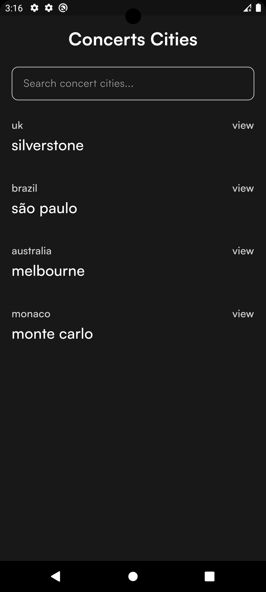

# Rock 'n' Roll Band Weather Track

**Rock 'n' Roll Band Weather Track** is a cross-platform mobile application (Android and iOS) to track the weather fashionably for a rock'n'roll band staff. Note that the `develop` branch is the most up-to-date, I've been making regular changes to improve the product.

🧪 **Unit & Widget Tests! (90% coverage!)**

## Table of Contents
- [Features](#features)
- [Screenshots](#screenshots)
- [Requirements](#requirements)
- [Configure Environment Variables](#configure-environment-variables)
- [Getting Started](#getting-started)

## Features
This application has the following features
- A list of cities for upcoming concerts
- Search functionality (Find by city name)
- Offline support using Hive (works with airplane mode)
- Cross-platform (tested on Pixel 6a, iPhone 15 Pro and iPad Pro)
- Support for multiple resolutions and sizes (tested on Pixel 4 and Pixel C Tab)
- Shows current weather info for each city
- Shows the next 5 days forecast for each city

## Screenshots
### Android
<div style="display: flex;">
    
    
</div>

### iOS
<div style="display: flex;">
    
    
</div>

## Requirements
- Operating System (Windows, Linux, or MacOS)
- IDE with Flutter SDK installed (Visual Studio Code, Android Studio, etc.)
- Knowledge of Dart and Flutter
- Emulator or Mobile Device
- Knowledge of environment variables
- Hands to code :smile:


## Configure Environment Variables

**NOTE:** This project uses Flutter `version 3.13.8`

You will need to have the environment configured for the project to function properly, if you don't you will encounter errors. Fear not though, the bulk of the work has been done already, all you need is to get your OpenWeather APP ID (or API KEY) that will be used to get the weather information and create a `.env` file.

To get an OpenWeather APP ID, visit [this link](https://home.openweathermap.org/api_keys).

Please note that if you do not have an OpenWeather account yet, you will need to create one.

**Create a `.env` file in the base of your project**

```
├── rock_n_roll_forecast
│   ├── ...
│   ├── ...
│   ├── .env
```

**Add the following to the .env file**

```env
APP_ID=APP ID from OpenWeather API
BASE_URL=https://api.openweathermap.org
```

## Getting Started

**1. Clone the Repository:** Open your terminal and clone the "rock_n_roll_forecast" repository to your local machine:

```sh
$ git clone https://github.com/devwraithe/rock_n_roll_forecast
```

**2. Navigate to the Project Folder:** Change your working directory to the project folder:

```
$ cd rock_n_roll_forecast
```

**3. Install the Dependencies:** Install the project's dependencies using **pub** (Dart Package Manager):

```sh
$ flutter pub get
```

### Usage

To run and use the application, ensure you have either an emulator or a mobile device connected to your IDE. **[Here](https://developer.android.com/design-for-safety/privacy-sandbox/download#:~:text=Set%20up%20an%20Android%20device%20emulator%20image,-To%20set%20up&text=In%20Android%20Studio%2C%20go%20to,it%20isn't%20already%20installed.)** is a guide from the Android Developers' documentation to help you set up a device or an emulator.

**1. Run the Application:** To start the "rock_n_roll_forecast" application, run the following command:

```sh
$ flutter run
```

### Running the project

**Option 1:** If you intend to run the project via the command line using `flutter run`, you will need to attach additional arguments to the code to be able to pull the environment variables from the `.env` file and include it in the project at compile-time.

```yaml
flutter run --dart-define-from-file=.env
```

**Option 2:** If you'd prefer to run the project on Android Studio, you should edit your configuration to avoid running **Option 1** every time, the image below shows how you can configure your `main.dart` on Android Studio to include your `.env` at compile-time.


### Testing
The `test` folder is similar to the `lib` folder with the addition of some utilities for testing. More tests are being added.

[`mockito`](https://pub.dev/packages/mockito) is used for creating mocks and stubs in unit tests to isolate and emulate dependencies.

[`bloc_test`](https://pub.dev/packages/bloc_test) is used for testing BLoC implementations by providing utilities for mocking.
  
To explore the test coverage, run tests with the --coverage argument

```sh
$ flutter test --coverage
```

To generate coverage files for the test, you might need to install `lcov` if you don't have it installed already. To install on **MacOS** & **Linux**, run `brew install lcov` and to install on **Windows**, run `choco install lcov`, then you should run the following code to generate the test coverage:

```sh
$ genhtml coverage/lcov.info -o coverage/html
```

To open the generated html file

```sh
$ open coverage/html/index.html
```
